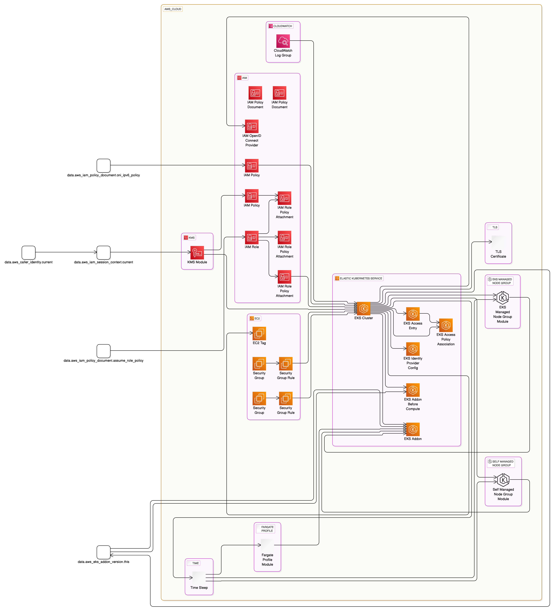

# Convert Terraform code to Eraser Diagram Benchmark

## Example 1: Terraform EKS Module

### Source

<https://github.com/terraform-aws-modules/terraform-aws-eks>

### Stakpak

#### Diagram



#### Code

```
direction right

aws_cloud {
  aws_eks [icon: "aws-eks", label: "Elastic Kubernetes Service"] {
    aws_eks_cluster.this [icon: "aws-eks", label: "EKS Cluster"]
    aws_eks_access_entry.this [icon: "aws-eks", label: "EKS Access Entry"]
    aws_eks_access_policy_association.this [icon: "aws-eks", label: "EKS Access Policy Association"]
    aws_eks_addon.this [icon: "aws-eks", label: "EKS Addon"]
    aws_eks_addon.before_compute [icon: "aws-eks", label: "EKS Addon Before Compute"]
    aws_eks_identity_provider_config.this [icon: "aws-eks", label: "EKS Identity Provider Config"]
  }
  aws_ec2 [icon: "aws-ec2", label: "EC2"] {
    aws_ec2_tag.cluster_primary_security_group [icon: "aws-ec2", label: "EC2 Tag"]
    aws_security_group.cluster [icon: "aws-ec2", label: "Security Group"]
    aws_security_group_rule.cluster [icon: "aws-ec2", label: "Security Group Rule"]
    aws_security_group.node [icon: "aws-ec2", label: "Security Group"]
    aws_security_group_rule.node [icon: "aws-ec2", label: "Security Group Rule"]
  }
  aws_cloudwatch [icon: "aws-cloudwatch", label: "CloudWatch"] {
    aws_cloudwatch_log_group.this [icon: "aws-cloudwatch", label: "CloudWatch Log Group"]
  }
  aws_iam [icon: "aws-iam", label: "IAM"] {
    aws_iam_openid_connect_provider.oidc_provider [icon: "aws-iam", label: "IAM OpenID Connect Provider"]
    aws_iam_policy_document.assume_role_policy [icon: "aws-iam", label: "IAM Policy Document"]
    aws_iam_policy_document.cni_ipv6_policy [icon: "aws-iam", label: "IAM Policy Document"]
    aws_iam_policy.cni_ipv6_policy [icon: "aws-iam", label: "IAM Policy"]
    aws_iam_policy.cluster_encryption [icon: "aws-iam", label: "IAM Policy"]
    aws_iam_role.this [icon: "aws-iam", label: "IAM Role"]
    aws_iam_role_policy_attachment.this [icon: "aws-iam", label: "IAM Role Policy Attachment"]
    aws_iam_role_policy_attachment.additional [icon: "aws-iam", label: "IAM Role Policy Attachment"]
    aws_iam_role_policy_attachment.cluster_encryption [icon: "aws-iam", label: "IAM Role Policy Attachment"]
  }
  aws_kms [icon: "aws-kms", label: "KMS"] {
    module.kms [icon: "aws-kms", label: "KMS Module"]
  }
  tls [icon: "tls", label: "TLS"] {
    data.tls_certificate.this [icon: "tls", label: "TLS Certificate"]
  }
  time [icon: "time", label: "Time"] {
    resource.time_sleep.this [icon: "time", label: "Time Sleep"]
  }
  eks_managed_node_group [icon: "eks", label: "EKS Managed Node Group"] {
    module.eks_managed_node_group [icon: "eks", label: "EKS Managed Node Group Module"]
  }
  self_managed_node_group [icon: "eks", label: "Self Managed Node Group"] {
    module.self_managed_node_group [icon: "eks", label: "Self Managed Node Group Module"]
  }
  fargate_profile [icon: "fargate", label: "Fargate Profile"] {
    module.fargate_profile [icon: "fargate", label: "Fargate Profile Module"]
  }
}

// Connections
data.aws_caller_identity.current > data.aws_iam_session_context.current
module.kms > aws_eks_cluster.this
aws_iam_role_policy_attachment.this > aws_eks_cluster.this
aws_security_group_rule.cluster > aws_eks_cluster.this
aws_security_group_rule.node > aws_eks_cluster.this
aws_cloudwatch_log_group.this > aws_eks_cluster.this
aws_iam_policy.cni_ipv6_policy > aws_eks_cluster.this
aws_eks_cluster.this > aws_ec2_tag.cluster_primary_security_group
aws_eks_cluster.this > aws_eks_access_entry.this
aws_eks_cluster.this > aws_eks_access_policy_association.this
aws_eks_access_entry.this > aws_eks_access_policy_association.this
data.aws_iam_session_context.current > module.kms
aws_security_group.cluster > aws_security_group_rule.cluster
aws_eks_cluster.this > data.tls_certificate.this
aws_eks_cluster.this > aws_iam_openid_connect_provider.oidc_provider
data.aws_iam_policy_document.assume_role_policy > aws_iam_role.this
aws_iam_role.this > aws_iam_role_policy_attachment.this
aws_iam_role.this > aws_iam_role_policy_attachment.additional
aws_iam_policy.cluster_encryption > aws_iam_role_policy_attachment.cluster_encryption
aws_iam_role.this > aws_iam_role_policy_attachment.cluster_encryption
module.kms > aws_iam_policy.cluster_encryption
aws_eks_cluster.this > data.aws_eks_addon_version.this
aws_eks_cluster.this > aws_eks_addon.this
data.aws_eks_addon_version.this > aws_eks_addon.this
module.fargate_profile > aws_eks_addon.this
module.eks_managed_node_group > aws_eks_addon.this
module.self_managed_node_group > aws_eks_addon.this
aws_eks_cluster.this > aws_eks_addon.before_compute
data.aws_eks_addon_version.this > aws_eks_addon.before_compute
aws_eks_cluster.this > aws_eks_identity_provider_config.this
aws_eks_cluster.this > resource.time_sleep.this
aws_eks_cluster.this > resource.time_sleep.this
aws_eks_cluster.this > resource.time_sleep.this
aws_eks_cluster.this > resource.time_sleep.this
data.aws_iam_policy_document.cni_ipv6_policy > aws_iam_policy.cni_ipv6_policy
aws_security_group.node > aws_security_group_rule.node
resource.time_sleep.this > module.fargate_profile
resource.time_sleep.this > module.eks_managed_node_group
resource.time_sleep.this > module.eks_managed_node_group
resource.time_sleep.this > module.eks_managed_node_group
resource.time_sleep.this > module.eks_managed_node_group
resource.time_sleep.this > module.eks_managed_node_group
aws_eks_cluster.this > module.eks_managed_node_group
resource.time_sleep.this > module.self_managed_node_group
resource.time_sleep.this > module.self_managed_node_group
resource.time_sleep.this > module.self_managed_node_group
resource.time_sleep.this > module.self_managed_node_group
resource.time_sleep.this > module.self_managed_node_group
aws_eks_cluster.this > module.self_managed_node_group
```

### Metrics

- **LLM Time**: 21.462 Seconds
- **Total Time**: 25.281 Seconds
- **Total Cost**: $0.001678

### OpenAI o1-preview

#### Diagram


#### Code

```
direction right

aws_cloud {
  aws_eks [icon: "aws-eks", label: "Elastic Kubernetes Service"] {
    aws_eks_cluster.this [icon: "aws-eks", label: "EKS Cluster"]
    aws_eks_access_entry.this [icon: "aws-eks", label: "EKS Access Entry"]
    aws_eks_access_policy_association.this [icon: "aws-eks", label: "EKS Access Policy Association"]
    aws_eks_addon.this [icon: "aws-eks", label: "EKS Add-ons"]
    aws_eks_addon.before_compute [icon: "aws-eks", label: "EKS Pre-Compute Add-ons"]
    aws_eks_identity_provider_config.this [icon: "aws-eks", label: "EKS Identity Provider Config"]
    module.fargate_profile [icon: "aws-eks", label: "EKS Fargate Profiles"]
    module.eks_managed_node_group [icon: "aws-eks", label: "EKS Managed Node Groups"]
    module.self_managed_node_group [icon: "aws-eks", label: "EKS Self-Managed Node Groups"]
  }

  aws_iam [icon: "aws-iam", label: "Identity and Access Management"] {
    aws_iam_role.this [icon: "aws-iam", label: "EKS Cluster IAM Role"]
    aws_iam_role_policy_attachment.this [icon: "aws-iam", label: "IAM Role Policy Attachment"]
    aws_iam_role_policy_attachment.additional [icon: "aws-iam", label: "Additional IAM Role Policy Attachment"]
    aws_iam_role_policy_attachment.cluster_encryption [icon: "aws-iam", label: "Cluster Encryption IAM Policy Attachment"]
    aws_iam_policy.cluster_encryption [icon: "aws-iam", label: "Cluster Encryption IAM Policy"]
    aws_iam_policy.cni_ipv6_policy [icon: "aws-iam", label: "CNI IPv6 IAM Policy"]
    aws_iam_openid_connect_provider.oidc_provider [icon: "aws-iam", label: "OIDC Provider"]
  }

  aws_kms [icon: "aws-kms", label: "Key Management Service"] {
    module.kms [icon: "aws-kms", label: "EKS KMS Key Module"]
  }

  aws_cloudwatch [icon: "aws-cloudwatch", label: "CloudWatch"] {
    aws_cloudwatch_log_group.this [icon: "aws-cloudwatch", label: "CloudWatch Log Group"]
  }

  aws_ec2 [icon: "aws-ec2", label: "Elastic Compute Cloud"] {
    aws_security_group.cluster [icon: "aws-ec2", label: "Cluster Security Group"]
    aws_security_group_rule.cluster [icon: "aws-ec2", label: "Cluster Security Group Rules"]
    aws_security_group.node [icon: "aws-ec2", label: "Node Security Group"]
    aws_security_group_rule.node [icon: "aws-ec2", label: "Node Security Group Rules"]
    aws_ec2_tag.cluster_primary_security_group [icon: "aws-ec2", label: "Cluster Primary Security Group Tag"]
  }
}

// Connections
aws_eks_cluster.this > aws_iam_role.this
aws_eks_cluster.this > aws_iam_openid_connect_provider.oidc_provider
aws_eks_cluster.this > aws_security_group.cluster
aws_eks_cluster.this > aws_security_group.node
aws_eks_cluster.this > aws_cloudwatch_log_group.this
aws_eks_cluster.this > module.kms
aws_iam_role_policy_attachment.this > aws_iam_role.this
aws_iam_role_policy_attachment.additional > aws_iam_role.this
aws_iam_role_policy_attachment.cluster_encryption > aws_iam_role.this
aws_iam_role.this > aws_iam_policy.cluster_encryption
aws_security_group_rule.cluster > aws_security_group.cluster
aws_security_group_rule.node > aws_security_group.node
aws_ec2_tag.cluster_primary_security_group > aws_security_group.cluster
aws_eks_access_entry.this > aws_eks_cluster.this
aws_eks_access_policy_association.this > aws_eks_access_entry.this
module.eks_managed_node_group > aws_eks_cluster.this
module.self_managed_node_group > aws_eks_cluster.this
module.fargate_profile > aws_eks_cluster.this
```

### Metrics

- **Total Time**: 67.541 Seconds
- **Total Cost**: $0.5904

## Example 2: Terraform AWS Nextjs

### Source

<https://github.com/milliHQ/terraform-aws-next-js>

### Stakpak

#### Diagram


#### Code

```
direction right

aws_cloud {
  aws_dynamodb [icon: "aws-dynamodb", label: "DynamoDB"] {
    aws_dynamodb_table.aliases [icon: "aws-dynamodb", label: "Aliases Table"]
    aws_dynamodb_table.deployments [icon: "aws-dynamodb", label: "Deployments Table"]
  }
  aws_iam [icon: "aws-iam", label: "Identity and Access Management"] {
    aws_iam_policy.cloudformation_permission [icon: "aws-iam", label: "CloudFormation Permission Policy"]
    aws_iam_role.cloudformation_permission [icon: "aws-iam", label: "CloudFormation Permission Role"]
    data_aws_iam_policy_document.cloudformation_permission [icon: "aws-iam", label: "CloudFormation Permission Document"]
    data_aws_iam_policy_document.cloudformation_permission_assume_role [icon: "aws-iam", label: "CloudFormation Permission Assume Role Document"]
    data_aws_iam_policy_document.access_static_deployment [icon: "aws-iam", label: "Access Static Deployment Document"]
  }
  aws_cloudfront [icon: "aws-cloudfront", label: "CloudFront"] {
    aws_cloudfront_cache_policy.this [icon: "aws-cloudfront", label: "Cache Policy"]
    data_aws_cloudfront_origin_request_policy.managed_all_viewer [icon: "aws-cloudfront", label: "Origin Request Policy"]
  }
  aws_region [icon: "aws-region", label: "Region"] {
    data_aws_region.current [icon: "aws-region", label: "Current Region"]
  }
  modules [icon: "aws-modules", label: "Modules"] {
    module.deploy_controller [icon: "aws-modules", label: "Deploy Controller"]
    module.statics_deploy [icon: "aws-modules", label: "Statics Deploy"]
    module.api [icon: "aws-modules", label: "API"]
    module.next_image [icon: "aws-modules", label: "Next Image"]
    module.proxy_config [icon: "aws-modules", label: "Proxy Config"]
    module.proxy [icon: "aws-modules", label: "Proxy"]
    module.cloudfront_main [icon: "aws-modules", label: "CloudFront Main"]
  }
}

// Connections
module.deploy_controller > data_aws_iam_policy_document.cloudformation_permission
module.statics_deploy > data_aws_iam_policy_document.cloudformation_permission
data_aws_iam_policy_document.cloudformation_permission > aws_iam_policy.cloudformation_permission
data_aws_iam_policy_document.cloudformation_permission_assume_role > aws_iam_role.cloudformation_permission
aws_iam_policy.cloudformation_permission > aws_iam_role.cloudformation_permission
data_aws_region.current > module.deploy_controller
aws_dynamodb_table.aliases > module.deploy_controller
aws_dynamodb_table.deployments > module.deploy_controller
module.cloudfront_main > module.statics_deploy
module.deploy_controller > module.statics_deploy
data_aws_region.current > module.statics_deploy
aws_dynamodb_table.aliases > module.statics_deploy
aws_dynamodb_table.deployments > module.statics_deploy
aws_iam_role.cloudformation_permission > module.statics_deploy
data_aws_region.current > module.api
aws_dynamodb_table.aliases > module.api
aws_dynamodb_table.deployments > module.api
module.statics_deploy > module.api
module.statics_deploy > data_aws_iam_policy_document.access_static_deployment
data_aws_iam_policy_document.access_static_deployment > module.next_image
data_aws_region.current > module.proxy_config
aws_dynamodb_table.aliases > module.proxy_config
module.statics_deploy > module.proxy_config
```

### Metrics

- **LLM Time**: 10.54 Seconds
- **Total Time**: 11.146 Seconds
- **Total Cost**: $0.001023

### OpenAI o1-preview

#### Diagram


#### Code

```
direction right

aws_cloud {
  aws_dynamodb [icon: "aws-dynamodb", label: "Amazon DynamoDB"] {
    aws_dynamodb_table.aliases [icon: "aws-dynamodb-table", label: "DynamoDB Table - Aliases"]
    aws_dynamodb_table.deployments [icon: "aws-dynamodb-table", label: "DynamoDB Table - Deployments"]
  }

  aws_iam [icon: "aws-iam", label: "AWS Identity and Access Management"] {
    aws_iam_policy.cloudformation_permission [icon: "aws-iam-policy", label: "IAM Policy - CloudFormation Permission"]
    aws_iam_role.cloudformation_permission [icon: "aws-iam-role", label: "IAM Role - CloudFormation Permission"]
  }

  aws_lambda [icon: "aws-lambda", label: "AWS Lambda"] {
    module.deploy_controller [icon: "aws-lambda", label: "Lambda Function - Deploy Controller"]
    module.statics_deploy [icon: "aws-lambda", label: "Lambda Function - Statics Deploy"]
    module.api [icon: "aws-lambda", label: "Lambda Function - API"]
    module.next_image [icon: "aws-lambda", label: "Lambda Function - Next/Image"]
    module.proxy [icon: "aws-lambda", label: "Lambda Function - Proxy (Lambda@Edge)"]
  }

  aws_s3 [icon: "aws-s3", label: "Amazon S3"] {
    module.statics_deploy.static_bucket [icon: "aws-s3", label: "S3 Bucket - Static Content"]
  }

  aws_cloudfront [icon: "aws-cloudfront", label: "Amazon CloudFront"] {
    aws_cloudfront_cache_policy.this [icon: "aws-cloudfront", label: "CloudFront Cache Policy"]
    module.cloudfront_main [icon: "aws-cloudfront", label: "CloudFront Distribution"]
  }
}

// Connections
aws_iam_policy.cloudformation_permission > aws_iam_role.cloudformation_permission
aws_iam_role.cloudformation_permission > module.statics_deploy
aws_dynamodb_table.aliases > module.deploy_controller
aws_dynamodb_table.deployments > module.deploy_controller
aws_dynamodb_table.aliases > module.statics_deploy
aws_dynamodb_table.deployments > module.statics_deploy
module.deploy_controller > module.statics_deploy
module.statics_deploy > module.api
module.statics_deploy > module.next_image
module.statics_deploy > module.cloudfront_main
module.next_image > module.cloudfront_main
module.proxy_config > module.cloudfront_main
module.proxy > module.cloudfront_main
```

### Metrics

- **Total Time**: 61.910 Seconds
- **Total Cost**: $0.45

## Example 3: Terraform AWS Lambda Module

### Source

<https://github.com/terraform-aws-modules/terraform-aws-lambda>

#### Diagram


#### Code

```
direction right

aws_cloud {
  aws_iam [icon: "aws-iam", label: "Identity and Access Management"] {
    aws_iam_role.lambda [icon: "aws-iam", label: "Lambda Execution Role"]
    aws_iam_policy_document.assume_role [icon: "aws-iam", label: "Assume Role Policy Document"]
    aws_iam_policy_document.logs [icon: "aws-iam", label: "Logs Policy Document"]
    aws_iam_policy.logs [icon: "aws-iam", label: "Logs Policy"]
    aws_iam_policy_document.dead_letter [icon: "aws-iam", label: "Dead Letter Policy Document"]
    aws_iam_policy.dead_letter [icon: "aws-iam", label: "Dead Letter Policy"]
    aws_iam_policy_document.async [icon: "aws-iam", label: "Async Policy Document"]
    aws_iam_policy.async [icon: "aws-iam", label: "Async Policy"]
    aws_iam_policy_document.additional_inline [icon: "aws-iam", label: "Additional Inline Policy Document"]
    aws_iam_policy.additional_inline [icon: "aws-iam", label: "Additional Inline Policy"]
    aws_iam_policy.additional_json [icon: "aws-iam", label: "Additional JSON Policy"]
    aws_iam_policy.additional_jsons [icon: "aws-iam", label: "Additional JSONs Policy"]
    aws_iam_policy.vpc [icon: "aws-iam", label: "VPC Policy"]
    aws_iam_policy.tracing [icon: "aws-iam", label: "Tracing Policy"]
  }
  aws_lambda [icon: "aws-lambda", label: "Lambda"] {
    aws_lambda_function.this [icon: "aws-lambda", label: "Lambda Function"]
    aws_lambda_layer_version.this [icon: "aws-lambda", label: "Lambda Layer Version"]
    aws_lambda_provisioned_concurrency_config.current_version [icon: "aws-lambda", label: "Provisioned Concurrency Config"]
    aws_lambda_function_event_invoke_config.this [icon: "aws-lambda", label: "Function Event Invoke Config"]
    aws_lambda_permission.current_version_triggers [icon: "aws-lambda", label: "Permission"]
    aws_lambda_permission.unqualified_alias_triggers [icon: "aws-lambda", label: "Permission"]
    aws_lambda_event_source_mapping.this [icon: "aws-lambda", label: "Event Source Mapping"]
    aws_lambda_function_url.this [icon: "aws-lambda", label: "Function URL"]
  }
  aws_s3 [icon: "aws-s3", label: "S3"] {
    aws_s3_object.lambda_package [icon: "aws-s3", label: "Lambda Package"]
  }
  aws_cloudwatch [icon: "aws-cloudwatch", label: "CloudWatch"] {
    aws_cloudwatch_log_group.lambda [icon: "aws-cloudwatch", label: "Log Group"]
  }
  external [icon: "external", label: "External"] {
    data.external.archive_prepare [icon: "external", label: "Archive Prepare"]
  }
  null_resource [icon: "null-resource", label: "Null Resource"] {
    null_resource.archive [icon: "null-resource", label: "Archive"]
    null_resource.sam_metadata_aws_lambda_function [icon: "null-resource", label: "SAM Metadata"]
    null_resource.sam_metadata_aws_lambda_layer_version [icon: "null-resource", label: "SAM Metadata"]
  }
  local_file [icon: "local-file", label: "Local File"] {
    local_file.archive_plan [icon: "local-file", label: "Archive Plan"]
  }
}

// Connections
aws_iam_policy_document.assume_role > aws_iam_role.lambda
aws_iam_policy_document.logs > aws_iam_policy.logs
aws_iam_role.lambda > aws_iam_role_policy_attachment.logs
aws_iam_policy.logs > aws_iam_role_policy_attachment.logs
aws_iam_policy_document.dead_letter > aws_iam_policy.dead_letter
aws_iam_role.lambda > aws_iam_role_policy_attachment.dead_letter
aws_iam_policy.dead_letter > aws_iam_role_policy_attachment.dead_letter
aws_iam_policy_document.async > aws_iam_policy.async
aws_iam_role.lambda > aws_iam_role_policy_attachment.async
aws_iam_policy.async > aws_iam_role_policy_attachment.async
aws_iam_policy_document.additional_inline > aws_iam_policy.additional_inline
aws_iam_role.lambda > aws_iam_role_policy_attachment.additional_inline
aws_iam_policy.additional_inline > aws_iam_role_policy_attachment.additional_inline
aws_iam_role.lambda > aws_iam_role_policy_attachment.additional_json
aws_iam_policy.additional_json > aws_iam_role_policy_attachment.additional_json
aws_iam_role.lambda > aws_iam_role_policy_attachment.additional_jsons
aws_iam_policy.additional_jsons > aws_iam_role_policy_attachment.additional_jsons
aws_iam_role.lambda > aws_iam_role_policy_attachment.additional_one
aws_iam_role.lambda > aws_iam_role_policy_attachment.additional_many
aws_iam_role.lambda > aws_lambda_function.this
aws_partition.current > aws_lambda_function.this
null_resource.archive > aws_lambda_function.this
aws_s3_object.lambda_package > aws_lambda_function.this
aws_cloudwatch_log_group.lambda > aws_lambda_function.this
aws_iam_role_policy_attachment.additional_inline > aws_lambda_function.this
aws_iam_role_policy_attachment.additional_json > aws_lambda_function.this
aws_iam_role_policy_attachment.additional_jsons > aws_lambda_function.this
aws_iam_role_policy_attachment.additional_many > aws_lambda_function.this
aws_iam_role_policy_attachment.additional_one > aws_lambda_function.this
aws_iam_role_policy_attachment.async > aws_lambda_function.this
aws_iam_role_policy_attachment.logs > aws_lambda_function.this
aws_iam_role_policy_attachment.dead_letter > aws_lambda_function.this
aws_iam_role_policy_attachment.vpc > aws_lambda_function.this
aws_iam_role_policy_attachment.tracing > aws_lambda_function.this
null_resource.archive > aws_lambda_layer_version.this
aws_s3_object.lambda_package > aws_lambda_layer_version.this
data.external.archive_prepare > aws_s3_object.lambda_package
null_resource.archive > aws_s3_object.lambda_package
aws_lambda_function.this > aws_lambda_provisioned_concurrency_config.current_version
aws_lambda_function.this > aws_lambda_function_event_invoke_config.this
aws_lambda_function.this > aws_lambda_permission.current_version_triggers
aws_lambda_function.this > aws_lambda_permission.unqualified_alias_triggers
aws_lambda_function.this > aws_lambda_event_source_mapping.this
aws_lambda_function.this > aws_lambda_function_url.this
data.external.archive_prepare > null_resource.sam_metadata_aws_lambda_function
data.external.archive_prepare > null_resource.sam_metadata_aws_lambda_layer_version
null_resource.archive > null_resource.sam_metadata_aws_lambda_function
data.external.archive_prepare > local_file.archive_plan
local_file.archive_plan > null_resource.archive
```

### Metrics

- **LLM Time**: 18.01 Seconds
- **Total Time**: 18.781 Seconds
- **Total Cost**: $0.001921

### OpenAI o1-preview

#### Diagram


#### Code

```
direction right

aws_cloud {
  aws_eks [icon: "aws-eks", label: "Elastic Kubernetes Service"] {
    aws_eks_cluster.this [icon: "aws-eks", label: "EKS Cluster"]
    aws_eks_access_entry.this [icon: "aws-eks", label: "EKS Access Entry"]
    aws_eks_access_policy_association.this [icon: "aws-eks", label: "EKS Access Policy Association"]
    aws_eks_addon.this [icon: "aws-eks", label: "EKS Add-ons"]
    aws_eks_addon.before_compute [icon: "aws-eks", label: "EKS Pre-Compute Add-ons"]
    aws_eks_identity_provider_config.this [icon: "aws-eks", label: "EKS Identity Provider Config"]
    module.fargate_profile [icon: "aws-eks", label: "EKS Fargate Profiles"]
    module.eks_managed_node_group [icon: "aws-eks", label: "EKS Managed Node Groups"]
    module.self_managed_node_group [icon: "aws-eks", label: "EKS Self-Managed Node Groups"]
  }

  aws_iam [icon: "aws-iam", label: "Identity and Access Management"] {
    aws_iam_role.this [icon: "aws-iam", label: "EKS Cluster IAM Role"]
    aws_iam_role_policy_attachment.this [icon: "aws-iam", label: "IAM Role Policy Attachment"]
    aws_iam_role_policy_attachment.additional [icon: "aws-iam", label: "Additional IAM Role Policy Attachment"]
    aws_iam_role_policy_attachment.cluster_encryption [icon: "aws-iam", label: "Cluster Encryption IAM Policy Attachment"]
    aws_iam_policy.cluster_encryption [icon: "aws-iam", label: "Cluster Encryption IAM Policy"]
    aws_iam_policy.cni_ipv6_policy [icon: "aws-iam", label: "CNI IPv6 IAM Policy"]
    aws_iam_openid_connect_provider.oidc_provider [icon: "aws-iam", label: "OIDC Provider"]
  }

  aws_kms [icon: "aws-kms", label: "Key Management Service"] {
    module.kms [icon: "aws-kms", label: "EKS KMS Key Module"]
  }

  aws_cloudwatch [icon: "aws-cloudwatch", label: "CloudWatch"] {
    aws_cloudwatch_log_group.this [icon: "aws-cloudwatch", label: "CloudWatch Log Group"]
  }

  aws_ec2 [icon: "aws-ec2", label: "Elastic Compute Cloud"] {
    aws_security_group.cluster [icon: "aws-ec2", label: "Cluster Security Group"]
    aws_security_group_rule.cluster [icon: "aws-ec2", label: "Cluster Security Group Rules"]
    aws_security_group.node [icon: "aws-ec2", label: "Node Security Group"]
    aws_security_group_rule.node [icon: "aws-ec2", label: "Node Security Group Rules"]
    aws_ec2_tag.cluster_primary_security_group [icon: "aws-ec2", label: "Cluster Primary Security Group Tag"]
  }
}

// Connections
aws_eks_cluster.this > aws_iam_role.this
aws_eks_cluster.this > aws_iam_openid_connect_provider.oidc_provider
aws_eks_cluster.this > aws_security_group.cluster
aws_eks_cluster.this > aws_security_group.node
aws_eks_cluster.this > aws_cloudwatch_log_group.this
aws_eks_cluster.this > module.kms
aws_iam_role_policy_attachment.this > aws_iam_role.this
aws_iam_role_policy_attachment.additional > aws_iam_role.this
aws_iam_role_policy_attachment.cluster_encryption > aws_iam_role.this
aws_iam_role.this > aws_iam_policy.cluster_encryption
aws_security_group_rule.cluster > aws_security_group.cluster
aws_security_group_rule.node > aws_security_group.node
aws_ec2_tag.cluster_primary_security_group > aws_security_group.cluster
aws_eks_access_entry.this > aws_eks_cluster.this
aws_eks_access_policy_association.this > aws_eks_access_entry.this
module.eks_managed_node_group > aws_eks_cluster.this
module.self_managed_node_group > aws_eks_cluster.this
module.fargate_profile > aws_eks_cluster.this
```

### Metrics

- **Total Time**: 85.550 Seconds
- **Total Cost**: $0.72

## Example 4: Cloudposse AWS Route53 Resolver DNS Firewall

### Source

<https://github.com/cloudposse/terraform-aws-route53-resolver-dns-firewall>

#### Diagram


#### Code

```
aws_cloud {
  aws_route53 [icon: "aws-route53", label: "Route 53"] {
    aws_route53_resolver_firewall_config.default [icon: "aws-route53", label: "Resolver Firewall Config"]
    aws_route53_resolver_firewall_domain_list.default [icon: "aws-route53", label: "Resolver Firewall Domain List"]
    aws_route53_resolver_firewall_rule_group.default [icon: "aws-route53", label: "Resolver Firewall Rule Group"]
    aws_route53_resolver_firewall_rule_group_association.default [icon: "aws-route53", label: "Resolver Firewall Rule Group Association"]
    aws_route53_resolver_firewall_rule.default [icon: "aws-route53", label: "Resolver Firewall Rule"]
    aws_route53_resolver_query_log_config.default [icon: "aws-route53", label: "Resolver Query Log Config"]
    aws_route53_resolver_query_log_config_association.default [icon: "aws-route53", label: "Resolver Query Log Config Association"]
  }
}

// Connections
module.this > aws_route53_resolver_firewall_domain_list.default
module.this > aws_route53_resolver_firewall_rule_group.default
aws_route53_resolver_firewall_rule_group.default > aws_route53_resolver_firewall_rule_group_association.default
module.this > aws_route53_resolver_firewall_rule_group_association.default
module.this > aws_route53_resolver_query_log_config.default
aws_route53_resolver_query_log_config.default > aws_route53_resolver_query_log_config_association.default
```

### Metrics

- **LLM Time**: 4.33 Seconds
- **Total Time**: 4.918 Seconds
- **Total Cost**: $0.000515

### OpenAI o1-preview

#### Diagram


#### Code

```
direction right

aws_cloud {
  aws_route53_resolver [icon: "aws-route53", label: "Amazon Route 53 Resolver"] {
    route53_resolver_firewall [icon: "aws-route53", label: "Resolver DNS Firewall"] {
      aws_route53_resolver_firewall_config.default [icon: "aws-route53", label: "Firewall Config"]
      aws_route53_resolver_firewall_domain_list.default [icon: "aws-route53", label: "Firewall Domain List"]
      aws_route53_resolver_firewall_rule_group.default [icon: "aws-route53", label: "Firewall Rule Group"]
      aws_route53_resolver_firewall_rule_group_association.default [icon: "aws-route53", label: "Firewall Rule Group Association"]
      aws_route53_resolver_firewall_rule.default [icon: "aws-route53", label: "Firewall Rule"]
    }
    route53_resolver_query_logging [icon: "aws-route53", label: "Resolver Query Logging"] {
      aws_route53_resolver_query_log_config.default [icon: "aws-route53", label: "Query Log Config"]
      aws_route53_resolver_query_log_config_association.default [icon: "aws-route53", label: "Query Log Config Association"]
    }
  }
}

// Connections
aws_route53_resolver_firewall_rule_group_association.default > aws_route53_resolver_firewall_rule_group.default
aws_route53_resolver_firewall_rule.default > aws_route53_resolver_firewall_rule_group.default
aws_route53_resolver_firewall_rule.default > aws_route53_resolver_firewall_domain_list.default
aws_route53_resolver_query_log_config_association.default > aws_route53_resolver_query_log_config.default
```

### Metrics

- **Total Time**: 104.331 Seconds
- **Total Cost**: $0.52
