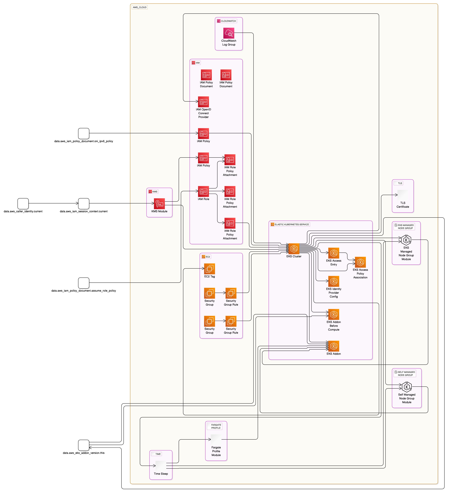

# Benchmarking converting terraform code to Eraser Diagram

## Example 1: Terraform EKS Module

### Source

<https://github.com/terraform-aws-modules/terraform-aws-eks>

### Stakpak

#### Diagram



#### Code

```
direction right

aws_cloud {
  aws_eks [icon: "aws-eks", label: "Elastic Kubernetes Service"] {
    aws_eks_cluster.this [icon: "aws-eks", label: "EKS Cluster"]
    aws_eks_access_entry.this [icon: "aws-eks", label: "EKS Access Entry"]
    aws_eks_access_policy_association.this [icon: "aws-eks", label: "EKS Access Policy Association"]
    aws_eks_addon.this [icon: "aws-eks", label: "EKS Addon"]
    aws_eks_addon.before_compute [icon: "aws-eks", label: "EKS Addon Before Compute"]
    aws_eks_identity_provider_config.this [icon: "aws-eks", label: "EKS Identity Provider Config"]
  }
  aws_ec2 [icon: "aws-ec2", label: "EC2"] {
    aws_ec2_tag.cluster_primary_security_group [icon: "aws-ec2", label: "EC2 Tag"]
    aws_security_group.cluster [icon: "aws-ec2", label: "Security Group"]
    aws_security_group_rule.cluster [icon: "aws-ec2", label: "Security Group Rule"]
    aws_security_group.node [icon: "aws-ec2", label: "Security Group"]
    aws_security_group_rule.node [icon: "aws-ec2", label: "Security Group Rule"]
  }
  aws_cloudwatch [icon: "aws-cloudwatch", label: "CloudWatch"] {
    aws_cloudwatch_log_group.this [icon: "aws-cloudwatch", label: "CloudWatch Log Group"]
  }
  aws_iam [icon: "aws-iam", label: "IAM"] {
    aws_iam_openid_connect_provider.oidc_provider [icon: "aws-iam", label: "IAM OpenID Connect Provider"]
    aws_iam_policy_document.assume_role_policy [icon: "aws-iam", label: "IAM Policy Document"]
    aws_iam_policy_document.cni_ipv6_policy [icon: "aws-iam", label: "IAM Policy Document"]
    aws_iam_policy.cni_ipv6_policy [icon: "aws-iam", label: "IAM Policy"]
    aws_iam_policy.cluster_encryption [icon: "aws-iam", label: "IAM Policy"]
    aws_iam_role.this [icon: "aws-iam", label: "IAM Role"]
    aws_iam_role_policy_attachment.this [icon: "aws-iam", label: "IAM Role Policy Attachment"]
    aws_iam_role_policy_attachment.additional [icon: "aws-iam", label: "IAM Role Policy Attachment"]
    aws_iam_role_policy_attachment.cluster_encryption [icon: "aws-iam", label: "IAM Role Policy Attachment"]
  }
  aws_kms [icon: "aws-kms", label: "KMS"] {
    module.kms [icon: "aws-kms", label: "KMS Module"]
  }
  tls [icon: "tls", label: "TLS"] {
    data.tls_certificate.this [icon: "tls", label: "TLS Certificate"]
  }
  time [icon: "time", label: "Time"] {
    resource.time_sleep.this [icon: "time", label: "Time Sleep"]
  }
  eks_managed_node_group [icon: "eks", label: "EKS Managed Node Group"] {
    module.eks_managed_node_group [icon: "eks", label: "EKS Managed Node Group Module"]
  }
  self_managed_node_group [icon: "eks", label: "Self Managed Node Group"] {
    module.self_managed_node_group [icon: "eks", label: "Self Managed Node Group Module"]
  }
  fargate_profile [icon: "fargate", label: "Fargate Profile"] {
    module.fargate_profile [icon: "fargate", label: "Fargate Profile Module"]
  }
}

// Connections
data.aws_caller_identity.current > data.aws_iam_session_context.current
module.kms > aws_eks_cluster.this
aws_iam_role_policy_attachment.this > aws_eks_cluster.this
aws_security_group_rule.cluster > aws_eks_cluster.this
aws_security_group_rule.node > aws_eks_cluster.this
aws_cloudwatch_log_group.this > aws_eks_cluster.this
aws_iam_policy.cni_ipv6_policy > aws_eks_cluster.this
aws_eks_cluster.this > aws_ec2_tag.cluster_primary_security_group
aws_eks_cluster.this > aws_eks_access_entry.this
aws_eks_cluster.this > aws_eks_access_policy_association.this
aws_eks_access_entry.this > aws_eks_access_policy_association.this
data.aws_iam_session_context.current > module.kms
aws_security_group.cluster > aws_security_group_rule.cluster
aws_eks_cluster.this > data.tls_certificate.this
aws_eks_cluster.this > aws_iam_openid_connect_provider.oidc_provider
data.aws_iam_policy_document.assume_role_policy > aws_iam_role.this
aws_iam_role.this > aws_iam_role_policy_attachment.this
aws_iam_role.this > aws_iam_role_policy_attachment.additional
aws_iam_policy.cluster_encryption > aws_iam_role_policy_attachment.cluster_encryption
aws_iam_role.this > aws_iam_role_policy_attachment.cluster_encryption
module.kms > aws_iam_policy.cluster_encryption
aws_eks_cluster.this > data.aws_eks_addon_version.this
aws_eks_cluster.this > aws_eks_addon.this
data.aws_eks_addon_version.this > aws_eks_addon.this
module.fargate_profile > aws_eks_addon.this
module.eks_managed_node_group > aws_eks_addon.this
module.self_managed_node_group > aws_eks_addon.this
aws_eks_cluster.this > aws_eks_addon.before_compute
data.aws_eks_addon_version.this > aws_eks_addon.before_compute
aws_eks_cluster.this > aws_eks_identity_provider_config.this
aws_eks_cluster.this > resource.time_sleep.this
aws_eks_cluster.this > resource.time_sleep.this
aws_eks_cluster.this > resource.time_sleep.this
aws_eks_cluster.this > resource.time_sleep.this
data.aws_iam_policy_document.cni_ipv6_policy > aws_iam_policy.cni_ipv6_policy
aws_security_group.node > aws_security_group_rule.node
resource.time_sleep.this > module.fargate_profile
resource.time_sleep.this > module.eks_managed_node_group
resource.time_sleep.this > module.eks_managed_node_group
resource.time_sleep.this > module.eks_managed_node_group
resource.time_sleep.this > module.eks_managed_node_group
resource.time_sleep.this > module.eks_managed_node_group
aws_eks_cluster.this > module.eks_managed_node_group
resource.time_sleep.this > module.self_managed_node_group
resource.time_sleep.this > module.self_managed_node_group
resource.time_sleep.this > module.self_managed_node_group
resource.time_sleep.this > module.self_managed_node_group
resource.time_sleep.this > module.self_managed_node_group
aws_eks_cluster.this > module.self_managed_node_group
```

### Metrics

- **Total Time**: 25 Seconds
- **Total Cost**: $0.001678


### OpenAI o1-preview

